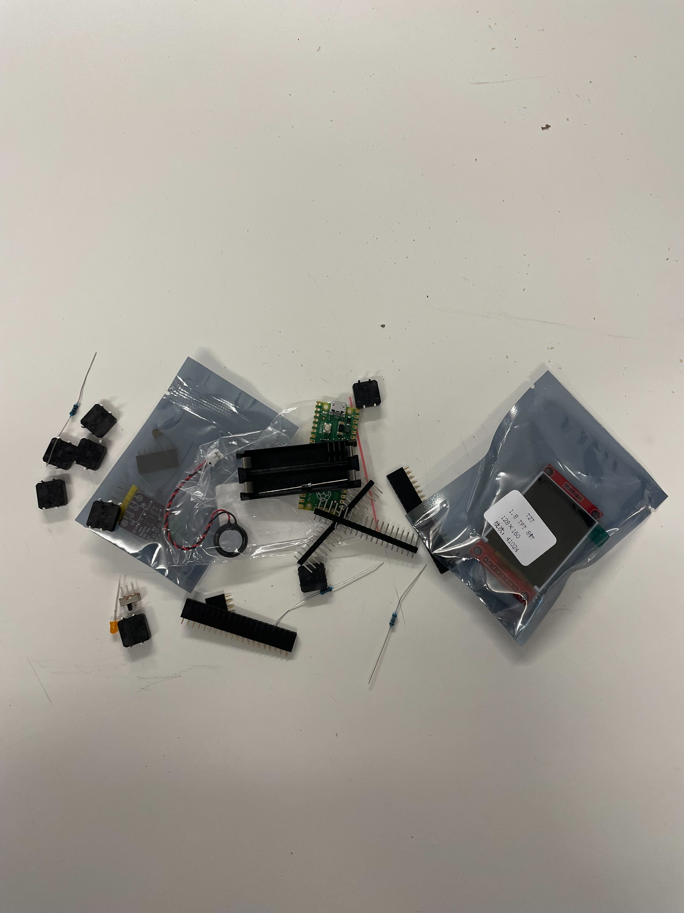
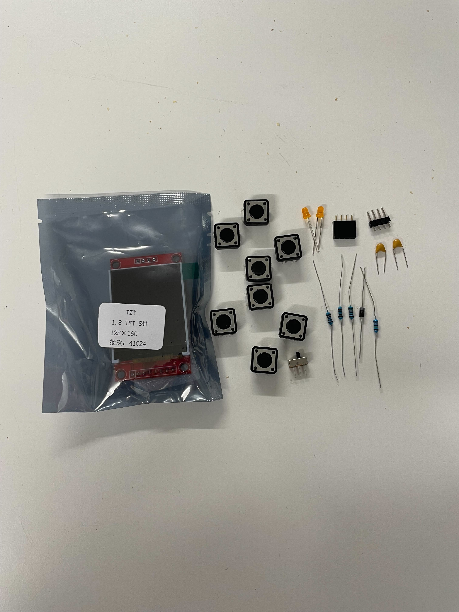
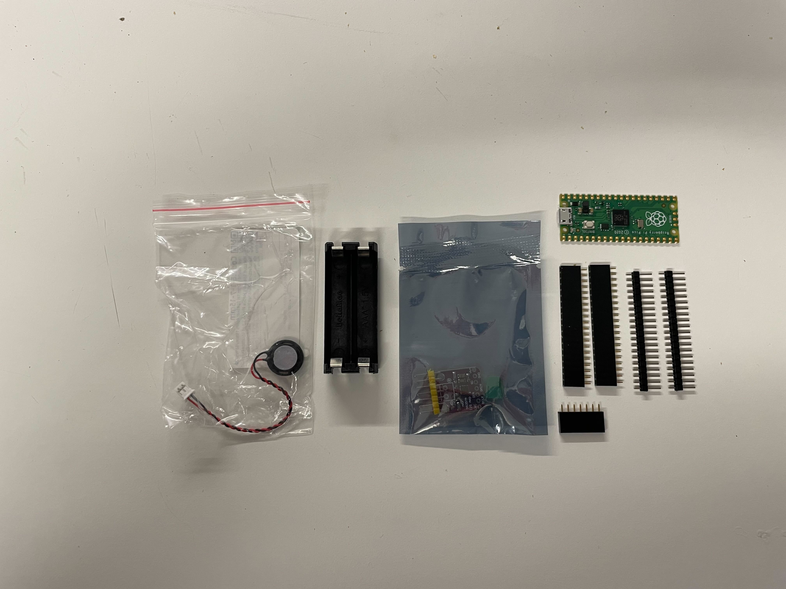
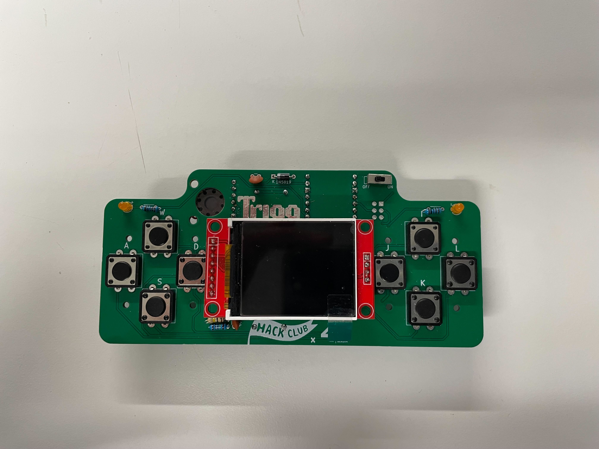
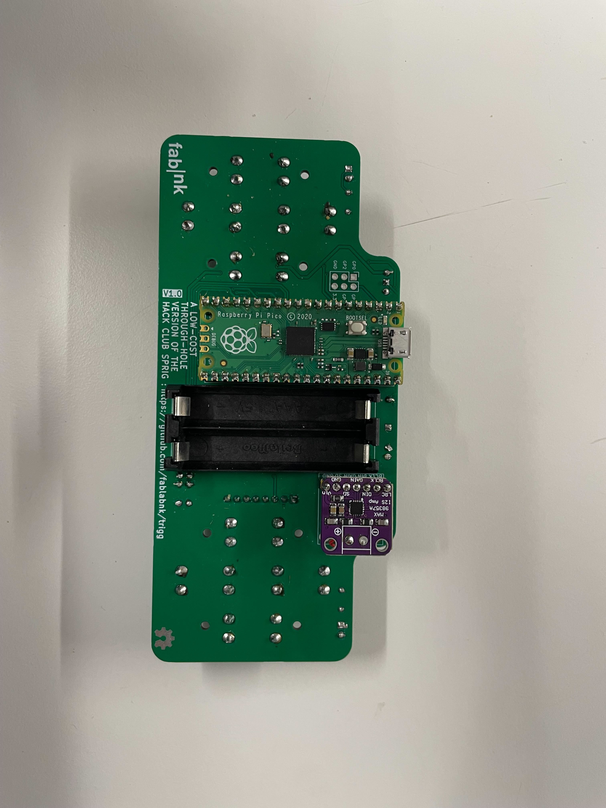

# Trigg Console Assembly Guide

## Introduction

Welcome to the Trigg Console assembly guide! This project is perfect for hobbyists and enthusiasts who enjoy working with electronic components. 
Follow this step-by-step guide carefully to build your console. Make sure all components are accounted for and organized before starting. 
Soldering is required for this project, so basic soldering skills are necessary. If you're new to soldering, we are here to support you.

## How to Start

To ensure a smooth assembly process, sort your components into two groups: one for the first stage (front side of the console) and another for the second stage of assembly (back side of the console). 
Work on a clean, well-lit surface to avoid losing any small parts. Have a soldering iron, solder, and tools like wire cutters and tweezers ready.
A damp sponge or brass wire cleaner will also be helpful to keep your soldering iron tip clean.

## List of Components

See [Bill of Materials](BillOfMaterials.md) 

### Components for the front side of the main board (first stage)

 - Display module
 - Push buttons (8 units)
 - LEDs (2 yellow LEDs)
 - Pin headers (8-pin and 4-pin female headers)
 - Pin headers (4-pin male headers)
 - Ceramic capacitors (2 small yellow components)
 - Resistors (4 units)
 - Toggle switch (1 small slide switch)

### Components for the back side of the main board (second stage)

 - Small speaker (1 unit, with a red-and-black wire)
 - Plastic mount (for batteries)
 - Sound board (inside the small anti-static bag)
 - Raspberry Pi Pico board (green microcontroller board)
 - 2 Pin headers (20-pin male headers)
 - 3 Pin headers (20-pin and 7-pin female headers)

## Step by Step

### Prepare your workspace
Clear your workspace and organize the components into two groups as shown above. 
Ensure you have all the necessary tools: a soldering iron, solder, wire cutters, a damp sponge and a brass wire cleaner. 
Plug in your soldering iron and let it heat up to the appropriate temperature (usually 330–380°C for most projects).

### If you solder for the first time, this [4-minute tutorial](https://www.youtube.com/watch?v=Qps9woUGkvI) can save you a ton of time and frustration

### While soldering
 - Ensure there is no dull or crumbly solder.
 - Ensure there are no bridges (unexpected solder connections between neighboring pins or components).
 - Ensure the solder forms a clean, cone-shaped joint around the pin.
 - Trim any excess wire sticking out using wire cutters.
 - Using flux (fluss) can make your soldering much easier.
 - Feel free to move and rotate soldered parts in such a way that while soldering a component the soldering iron doesn't touch (and possibly fry) the other one.

### Front side vs. back side
Front side of the main board has *TRIGG*, *HACKCLUB* and *42* logos as well as some of the components' hints engraved on it.
Back side has *fablab|nk* logo and the raspberry pi pinout engravings.

### Mount and solder capacitors (front side)
 - Mount capacitors into their positions on the front side of the main board.
 - Solder all leads to the PCB.

### Mount and solder LEDs and resistors (front side)
 - Insert the 2 yellow LEDs into their positions on the front side of the main board, ensuring the longer leg (positive) goes into the hole marked with a "+" sign.
 - Place the 4 resistors in their respective slots. If the resistors have color bands, follow the provided schematic for correct placement.
 - Solder all leads to the PCB and trim any excess wire sticking out using wire cutters.

### Mount and solder the toggle switch (front side)
 - Place the toggle switch into its slot on the front side of the main board. Ensure it is flush with the PCB surface.
 - Solder the switch terminals securely. Avoid overheating the switch by working quickly and efficiently.

### Mount and solder the buttons (front side)
- Place the 8 push buttons into their corresponding slots on the front side of the main board. Ensure they are aligned correctly.
- Solder the pins of each button to the board. Apply just enough solder to cover the pad without spilling over.

### Solder the Raspberry Pi Pico (back side)
 - Attach 20-pin male headers to the Raspberry Pi, then attach female headers to male ones.
 - Mount Rapberry pi with the attached male and female headers into it's designated position on the back side of the main board.
 - Solder the male headers to the Raspberry Pi.

### Mount the battery holder (back side)
 - Insert the plastic battery holder into it's designated position on the back side of the main board. 

### Solder the sound board and speaker (back side)
 - Insert 4-pin male header into the sound amplifier and solder it, then attach 4-pin female header to male one.
 - Remove the connector as well as ~5mm of insulation from the speaker's wires.
 - Solder speaker's wires to the amplifier respecting the polarity: red(+), black(-).
 - Glue speaker to the back side of the main board.
 - Insert sound amplifier with attached female header into it's designated place on the back side of the main board.

### Solder Raspberry, battery mount and sound card to the main board
 - Flip the main board with Raspberry, battery holder and sound card attached to it's back, so it's front side faces up.
 - Solder 20-pin female headers of Raspberry, 7-pin female header of sound card and 4 pins of the battery holder to the main board.

### Assemble and solder the display module (front side)
 - Solder 4-pin male header to the display module, attach 8-pin and 4-pin female headers to the male ones
 - Attach the display module altogether with male and female headers to it's designated position on the front side of the main board.
 - Flip the board with the attached display over, so it's back side faces up, and solder each of display's pins securely to main board.

### Final assembly
 - Double-check all soldered connections for stability and ensure no joints are "cold" (dull or crumbly solder).
 - Use a multimeter to test continuity and check for short circuits.
 - Insert the batteries, power on the console, and test its functionality.
 - Check for any solder bridges (accidental connections between pins) and correct them using a solder wick if necessary.

## Conclusion

Congratulations on completing your Trigg Console! If you encounter any issues, review each step and check for loose or improperly soldered connections. 
This project is a great starting point for experimenting with electronics, so feel free to customize and expand its functionality. Enjoy!
