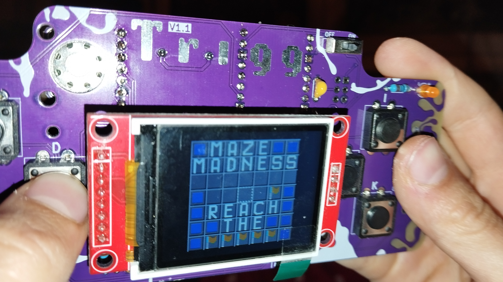

# So, What's a Trigg?

A Trigg is our hand-soldering-friendly kit version of the [Hack Club Sprig](https://sprig.hackclub.com/), a mini Raspberry Pi Pico-based games console for making tile-based games. Your can find our forked Trigg repo [here](https://github.com/fablabnk/Trigg).

Coding, uploading and sharing games is done using a simple browser-based IDE that connects directly to the device using the web serial API, keeping everything easy and fun.

In the fabrication lab of our coding school 42 Berlin, we adapted the original surface mount Sprig design to turn it into a through-hole soldering kit. Our aim was to lower the barrier for anyone to be able to build the console using basic soldering skills and without having to have fully assembled (PCBA) boards made.

With our version, you can simply order the PCB using a China-based fab-house (e.g. JLCPCB), source all other components on AliExpress and put it together. The total cost per unit is around €15.

# Getting Started: Laying Out the Components (Bill of Materials)

Below is a list all the components in your Trigg kit, in the order in which we will use them. This is a good opportunity to lay everything out in front of you and check all parts are there!

| Quantity | Description                                   |
|----------|-----------------------------------------------|
| 1        | Trigg Printed Circuit Board (not in bag)      |
| 8        | 12mm Tactile Switch                           |
| 1        | Raspberry Pi Pico (not in bag)               |
| 2        | 20-pin Header                                |
| 2        | 20-pin Socket                                |
| 2        | 1uF Ceramic Disc Capacitor  (104)            |
| 2        | 3mm LED                                |
| 1        | 1N5819 Diode                                 |
| 1        | 1M Resistor - Brown Black Black Yellow Brown |
| 1        | 100k Resistor - Brown Black Black Orange Brown |
| 2        | 1k Resistor - Brown Black Black Brown Brown |
| 1        | Mini Slide Switch                            |
| 1        | 1.8" TFT Display 120x160 (bagged separately) |
| 1        | 4-pin Header                                 |
| 1        | 4-pin Socket                                 |
| 1        | 8-pin Socket                                 |
| 1        | 2xAAA Battery Holder                         |
| 1        | 1W Speaker (bagged separately)               |
| 1        | Max98357A Amplifier Board (bagged separately)|
| 1        | 7-pin Socket                                 |

# Overview

Let's first zoom out and take a bird's eye view of the steps involved...

1. Solder the eight gaming buttons (otherwise known as tactile switches)
2. Solder pin headers onto our Raspberry Pi Pico (good practise!)
3. Solder all other front-side components (resistors, capacitors, LEDs, diode, switch, etc)
4. Solder the display pin headers and sockets and mount the display
5. Solder and mount all the back side components (Pico, battery holder, speaker and audio amplifier)
6. Test, learn how to flash, upload games and have fun with it ;)

# Step-By-Step Build Guide

## Step 0: 'Running in' the Iron

- A good iron should have a silvery tip and solder should run easily onto it at a standard temp of around 340 degrees. Don't start soldering components until this is the case!

- To get an iron in good shape: rotate the iron whilst applying solder to the tip to find a spot where the solder melts. Try to expand on this spot until the whole tip is silvery and solder melts everywhere. Return to this process anytime you notice the iron's performance deteriorating.

- Don't worry about wasting a little solder. When there's too much just clean up the tip on a wet sponge or wire brush as you go. 

## Silver rules of soldering

In soldering, we like silver - not golden - rules!

1. Apply the principle 'heat the place you want the solder to go'. Often this is both 'pad' and 'pin'.
2. Not too little, not too much solder: too little and the connection won't be solid, too much and you risk bridging other components
3. Solder should always 'fuse' to the pad, not ball up on top. If this happens, apply heat the the pad to encourage the solder the flow down in place
4. Start with temperature low (e.g. 340°C) and turn up if needed: larger areas or thicker wire require more heat
5. Snip away from you: when snipping off excess wire, aim the board away from you to avoid pinging yourself in the eye!

## Step 1: Solder the Tactile Switches

__Components needed:__ _8 x 12mm tactile switches labelled W, A, S, D (left side) and I, J, L, K (right side)_

These are the easiest components to solder in the whole build, as they have larger silver solder pads with plenty of space around them. This should get you off to a smooth start.

1. Insert the legs through the front of the board
2. Flip the board and bend the legs back slightly to hold the button in place

We recommend to place all the buttons before soldering any, as this forms a solid base. Then for each button:
1. Solder one leg and flip the board the check the button is sitting flush against the board. If not, you can still correct this now by applying heat and pushing on the button.
2. Solder the remaining legs

## Step 2: Solder the Pin Headers onto the Raspberry Pi Pico

__Components needed:__ _1 x Raspberry Pi Pico, 2 x 20 Pin Header, 2 x 20 Pin Socket_

It is possible to order pin-headers pre-soldered for a small extra charge - but as this a soldering workshop we can use the opportunity to get some much needed practice. We're going to make you work for your Trigg!

1. Insert the long legs of the two pin headers into their corresponding pin sockets, to use them as a solid base
2. Place the Raspberry Pi Pico on top of the pin headers, with the raspberry facing up
3. Solder the corner pins from the top, starting with whichever feels more comfortable
4. Solder all the pins inbetween

For now we can set our socketed Pico aside. Later we will solder it onto the back of our printed circuit board.

## Step 3: Solder Front-side Components

Now place and solder all other front-side components (listed below), as follows:

1. Insert the component into the marked place on the front side of the board
2. Flip the board and bend wires/pins back at 45 degrees to keep in place
3. Solder one of the pins/wires to the silver solder pad
4. Flip the board and check for flushness - correct this now if there are any issues
5. Solder the remaining pins/wires
6. Snip off any excess wires, taking care to point the board away from you

If you're new to soldering, we suggest to go component-by-component. If you have more experience, you may wish to place, solder and snip more components at one time.

### Capacitors

__Components needed:__ _2 x 1uF Ceramic Disc Capacitor_

- Shown on the board as 104 (this is the capacitor code for a 1uF capacitor)
- Orientation does not matter, it can be soldered either way round

### LEDs

__Components needed:__ _2 x 3mm LED_

- Shown as a circle inside another circle, with + and - marked at the top
- Orientation here _does_ matter, the longest leg should go through the square pad

### Diode

__Components needed:__ _1 x 1N5819 Diode_

- Orientation here _does_ matter, the silver line on the diode should align with the white line on the board. In addition, the leg closest to the silver line should go in the square pad marked with a K.

### Resistors

__Components needed:__ _1 x 1M Resistor (Brown, Black, Black, Yellow, Brown), 1 x 100k Resistor (Brown, Black, Black, Orange, Brown), 2 x 1k Resistor (Brown, Black, Black, Brown, Brown)_

- Shown simply as 1M, 100k and 1k on the board
- Orientation does not matter, they can be soldered either way round

### Slide Switch

__Components needed:__ _1 x Mini Slide Switch_

- Shown as a box at top right of PCB, marked with ON and OFF
- Orientation does not matter, it can be soldered either way round

The board should now look like this from the front and back:

## Step 4: Mounting the display

__Components needed:__ _1 x 1.8" TFT Display 120x160, 1 x 4-pin header, 1 x 8-pin socket, 1 x 4-pin socket_

The display comes in a separate anti-static bag, you can open this now if you haven't already.

In order to mount to the diplay, we will need to:
1. Solder the missing 4-pin header onto the right hand side of the display itself

2. Insert the display into the provided 8-pin and 4-pin sockets
3. Insert the socketed display into the front of the printed circuit board
4. Flip the board, rest it on the screen of the display
5. Solder both sockets in place, pin-by-pin, starting with one pin and checking for flushness

Here's how the front of the board looks with the display sockets soldered on and the display removed:

Note: If you prefer a 'low profile' screen instead of a raised one, it is possible to solder the display directly onto the pin-headers, without using the sockets. If you choose to do this however, the metal SD card slot on the back of the display should be covered with electrical or other isolating tape, to prevent it shorting against the pins that back onto it. Proceed at your own risk - so far we never tried it!

## Step 5: Soldering the Back-side Components

The back-side of the board contains only larger components such as the Raspberry Pi Pico, battery holder, speaker, and audio amplifier

### Battery Holder

- The 2xAAA battery holder has a small plastic dot on the back, which we need cut off it order for it to mount flush against the board. You can use the same - snippers to chop it off.

1. Insert the two pins of the battery holder into the holes on the back of the board. You may need to bend the pins to make them wider or narrower before they will both fit through
2. Flip the board, solder one pin, check for flushness, adjust if necessary and then solder the other pin

The board should now look like this:

### Raspberry Pi Pico

If you completed the earlier step, the Pico should have it's two pin headers soldered on and should already be inserted into it's two corresponding sockets. We will keep it like this to solder it onto the board, as follows:

1. Unmount the display from it's sockets to allow access to the Pico's solder pads
2. Insert the Pico from the back of the board, paying attention to the vertical orientation (the USB connector should face to the top of the board)
3. Flip the board over and rest it on the Pico. For extra stability, it can help here to already insert the pin-header and socket for the audio amplifier (see photo) - don't solder it yet though

4. Solder one corner pin of the Pico, check for flushness and adjust if necessary
5. Solder the opposite corner pin, then all the remaining pins. Take care when soldering close to the 4-pin socket for the display
6. Remount the display into it's sockets

### Assembling the Amplifier Board 

__Components needed:__ _Max98357A ClassD I2S Mono Amplifier Breakout Board, 7-pin header (yellow - in bag), 7-pin socket (black)_

The amplifier breakout board comes in a separate anti-static bag, open this now if you haven't already. Inside the bag you will find a yellow 7-pin header and a green screw terminal. We can discard the screw terminal (we won't use it as it would stick out too much from the back of our Trigg).

1. Insert the long legs of the yellow 7-pin header (from the bag) into the 7-pin socket (taken from the rest of our kit components)
2. Rest the board on the pin socket/header with the chip facing up and the names of the pins visible
3. Lay the board and the pin socket/header down in such a way that it forms a stable triangle (see photo).

4. Now solder each of the pins

### Attaching the Speaker to the Amplifier Board

1. Unbag the speaker
2. Cut off the speaker wires approx 2.5cm from speaker
3. Trim 4mm off the end of each wire and braid them together. 
4. Optionally lightly tin the end of each wire with solder. It should now look like this:

5. Push the wires up through the bottom of the board and solder them from the top. Take note that:
- The red wire goes to the plus (+) terminal
- The black wire goes to the minus (-) terminal

### Soldering the Amplifier Board and Speaker

1. Insert the amplifier board into the back of the Trigg using it's 7-pin socket
2. Flip the board, resting it on the Pico and amplifier board
3. Solder the pins
4. Flip board back over. Orient the speaker until the wire sits under the board (not outside it), then remove the white sticker from the speaker, align it with the printed ring on the circuit board and press down firmly

Now here is how it should look from the back and from the front:

### Flashing Firmware and Testing

- Your pico first needs to be flashed with the original Sprig Spade firmware. If you have any issues, as documented [here](https://github.com/hackclub/sprig/blob/main/docs/UPLOAD.md)
- For a reliable first try, connect the Trigg with a cable to a USB charger
- Once that works feel free to try with batteries
- To upload more games, connect the Pico via USB cable to your PC, head to [https://sprig.hackclub.com/gallery](https://sprig.hackclub.com/gallery) to design/modify games and flash them directly on the browser using the "Run on Device" option

### Known Bugs
- Some games work fine on the web IDE but show errors on the Trigg itself - we didn't yet investigate why...
- The LEDs don't appear to be used in any games yet (see issues section of GitHub)
- Use a freshly-charged set of batteries. Game-freezes can occur if the batteries are partially discharged.
- The GPIO header on PCB is supposed to be unused!

We hope you have fun playing with and coding for your Trigg! :)
